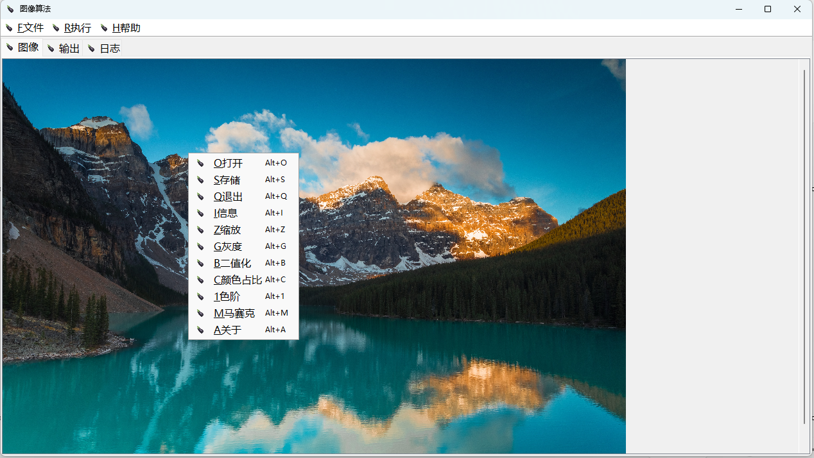
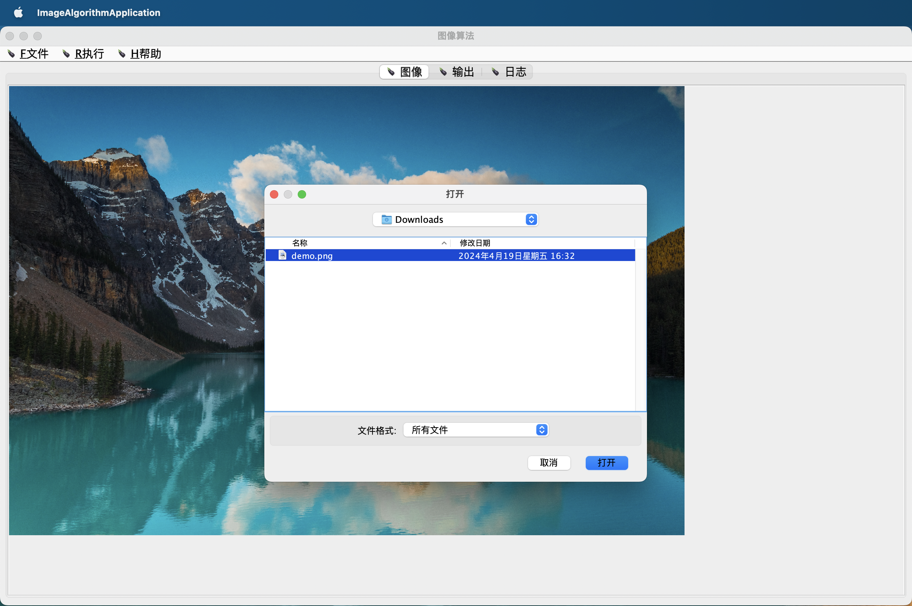

# ImageAlgorithm
Java Swing 图像处理 算法学习

## 说明

原图


页签（图像、输出、日志）


右键菜单


图像读取


比例缩放


灰度


二值化


关于


## 自定义算法

1. 在
```
\ImageAlgorithm\src\main\resources\menu.json
```
增加菜单项目

2. 菜单项的`name`对应`org.sauceggplant.ia.algorithm`中的类

增加一个算法类

3. 算法类实现`org.sauceggplant.ia.algorithm.Algorithm`接口

实现方法
```
@Override
public void run(IaPanel iaPanel){
        //打开的图像，文件路径
        String imagePath = iaPanel.getPath();
        //打开的图像，数据
        BufferedImage imageData = iaPanel.getContent().getImage();

        //获取图像中某个像素点的颜色,屏幕左上角坐标为(0,0),右下角坐标为(width-1,height-1)
        int rgb = imageData.getRGB(int x, int y);
        java.awt.Color c = new java.awt.Color(rgb);
        int red = c.getRed();       //红色 0--255
        int green = c.getGreen();   //绿色 0--255
        int blue = c.getBlue();     //蓝色 0--255
        int alpha = c.getAlpha();   //透明度

        //构建颜色,RGB色彩空间
        // (当 red=0,green=0,blue=0时，为黑色)
        // (当 red=255,green=255,blue=255时，为白色)
        java.awt.Color c1 = new java.awt.Color(red,green,blue,alpha);
        //变更某个像素点的颜色
        imageData.setRGB(int x, int y, c1.getRGB());

        //图像页签
        IaImagePanel content = iaPanel.getContent();
        //输出页签
        IaImagePanel output = iaPanel.getOutput();
        
        //将加工后的图像信息展示到输出页签
        output.setImage(imageData);
}
```