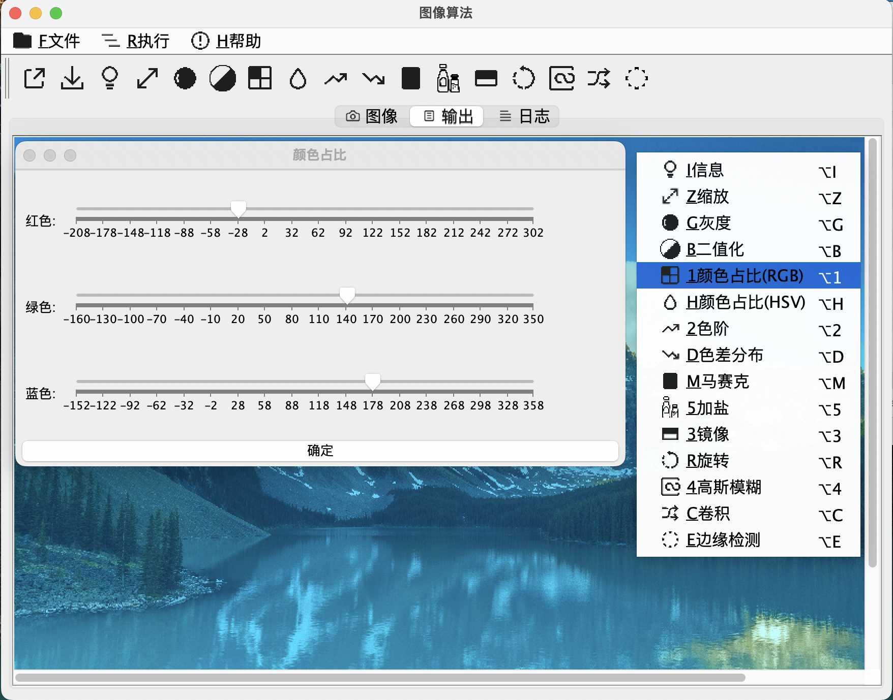
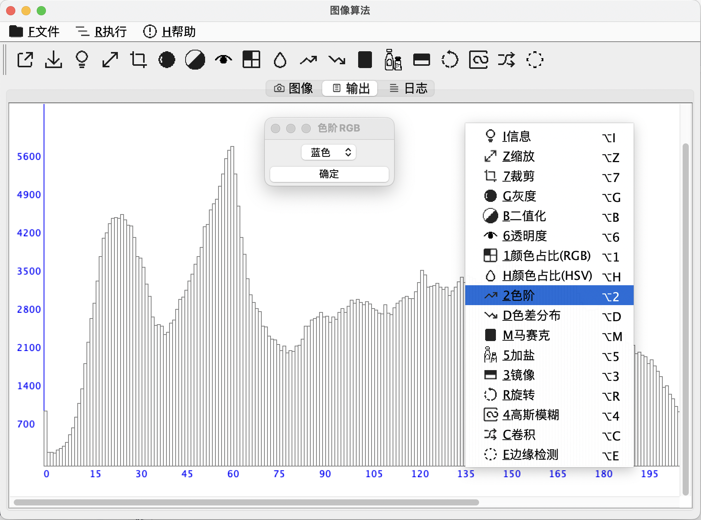
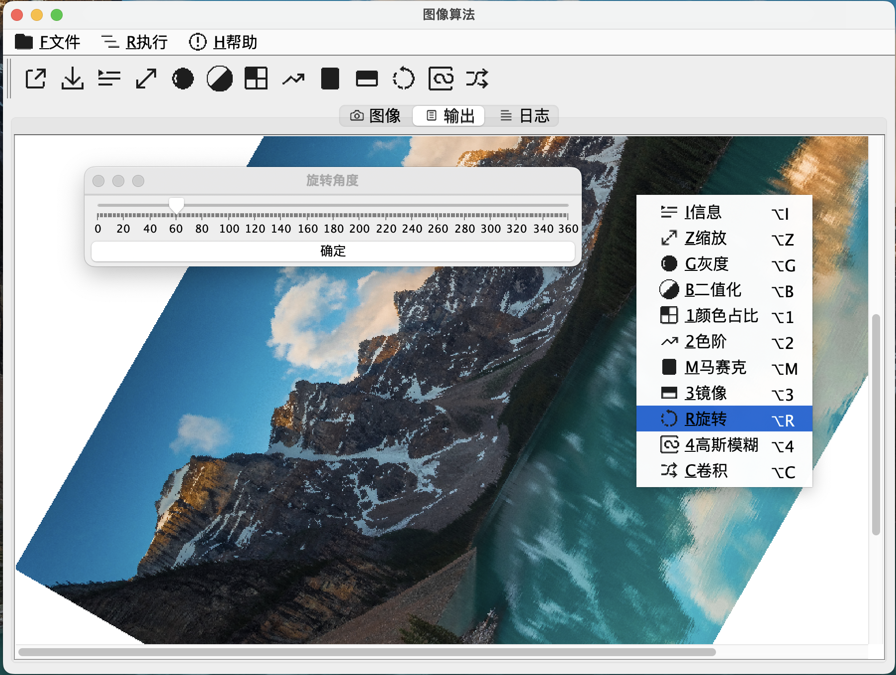
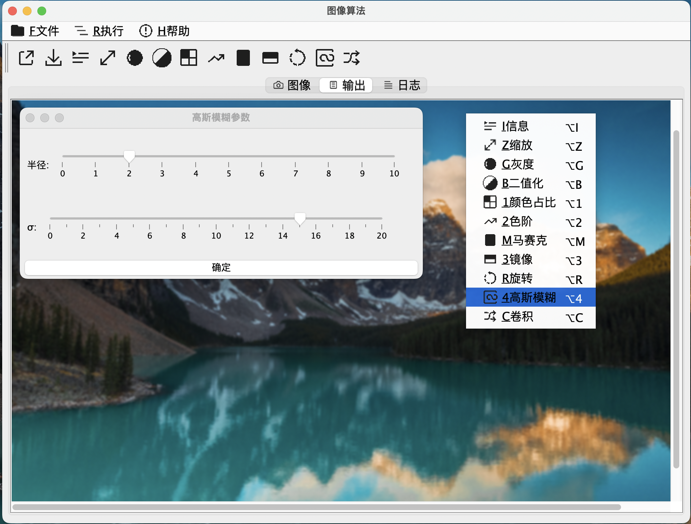

# ImageAlgorithm

Java Swing 图像处理 算法学习

## 原理

Java 通过 `java.awt.image.BufferedImage`类，对图像进行加工处理，

在RGB(计算机的三原色，R-red:红,G-green:绿,B-blue:蓝)色彩空间中，

可以理解为图像由三个矩阵(红色矩阵，绿色矩阵，蓝色矩阵)组成，

矩阵的行就是图像的宽， 矩阵的列就是图像的高，

图像的每个像素，就可以通过(x,y,rgb)表示，

即获取颜色`int rgb = BufferedImage.getRGB(int x, int y);`

赋值`BufferedImage.setRGB(int x, int y, int rgb);`

对于整型的rgb值，从`00000000-FFFFFFFF`,每2位16进制就代表一种含义，

分别是透明度，红，绿，蓝；

即

```java
int alpha = (rgb >> 24) & 0xFF;
```

```java
int red = (rgb >> 16) & 0xFF;
```

```java
int green = (rgb >> 8) & 0xFF;
```

```java
int blue = rgb & 0xFF;
```

`alpha`(0-完全透明,255-不透明),

`red`(0-无红色,255-饱满红色),

`green`(0-无绿色,255-饱满绿色),

`blue`(0-无蓝色,255-饱满蓝色),

计算机常用显示的颜色：

黑色(red=0,green=0,blue=0)

红色(red=255,green=0,blue=0)

绿色(red=0,green=255,blue=0)

蓝色(red=0,green=0,blue=255)

灰色(red=128,green=128,blue=128)

白色(red=255,green=255,blue=255)

在Java的`swing`组件中，

基于`javax.swing.JComponent`

`public void paint(Graphics g)` 对界面绘制。

坐标计算从左上角(0,0)开始计算，

`Graphics`封装的较完善，可以直接对点、线、几何图形、图像、文字等直接绘制。

## 说明

原图


页签（图像、输出、日志）


右键菜单


信息


图像读取


比例缩放


灰度


二值化


颜色占比


色阶


马赛克


镜像


旋转


高斯模糊

计算公式：




卷积


对于卷积计算，目前支持3阶算子（Sobel、Prewitt、Laplacian）和自定义算子

以下为灰度后卷积计算

索贝尔(Sobel)水平

```
[[-1.0,  -2.0,   -1.0],
[0.0,   0.0,    0.0],
[1.0,   2.0,    1.0]]
```


索贝尔(Sobel)垂直

```
[[-1.0, 0.0,    1.0],
[-2.0,  0.0,    2.0],
[-1.0,  0.0,    1.0]]
```


Prewitt水平

```
[[1.0,  1.0,    1.0],
[0.0,   0.0,    0.0],
[-1.0,  -1.0,   -1.0]]
```


Prewitt垂直

```
[[1.0,  0.0,    -1.0],
[1.0,    0.0,    -1.0],
[1.0,   0.0,    -1.0]]
```


拉普拉斯(Laplacian)4

```
[[0.0,  1.0,    0.0
1.0,    -4.0,   1.0
0.0,    1.0,    0.0]]
```


拉普拉斯(Laplacian)8

```
[[1.0,  1.0,    1.0],
[1.0,   -8.0,   1.0],
[1.0,   1.0,    1.0]]
```


拉普拉斯(Laplacian)变形1

```
[[-1.0,  -0.5,    -1.0],
[-0.5,   6.0,   -0.5],
[-1.0,   -0.5,    -1.0]]
```


拉普拉斯(Laplacian)变形2

```
[[1.0,  0.5,    1.0],
[0.5,   -6.0,   0.5],
[1.0,   0.5,    1.0]]
```


均值模糊

```
[[0.1111111111111111,  0.1111111111111111,  0.1111111111111111],
[0.1111111111111111, 0.1111111111111111, 0.1111111111111111],
[0.1111111111111111, 0.1111111111111111, 0.1111111111111111]]
```


高斯模糊

```
[[0.0625,   0.125,  0.0625],
[0.125,     0.25,   0.125],
[0.0625,    0.125,  0.0625]]
```


高斯模糊，sigma=1，归一化

```
[[0.075,    0.124,  0.075],
[0.124,     0.204,  0.124],
[0.075,     0.124,  0.075]]
```


关于


## 自定义算法

1. 在

```
\ImageAlgorithm\src\main\resources\menu.json
```

增加菜单项目

2. 菜单项的`name`对应`org.sauceggplant.ia.algorithm`中的类

增加一个算法类

3. 算法类实现`org.sauceggplant.ia.algorithm.Algorithm`接口

实现方法`public void run(IaPanel iaPanel)`

```java

@Override
public void run(IaPanel iaPanel) {
    //打开的图像，文件路径
    String imagePath = iaPanel.getPath();
    //打开的图像，数据
    BufferedImage imageData = iaPanel.getContent().getImage();

    //获取图像中某个像素点的颜色,屏幕左上角坐标为(0,0),右下角坐标为(width-1,height-1)
    int rgb = imageData.getRGB( int x, int y);
    java.awt.Color c = new java.awt.Color(rgb);
    int red = c.getRed();       //红色 0--255
    int green = c.getGreen();   //绿色 0--255
    int blue = c.getBlue();     //蓝色 0--255
    int alpha = c.getAlpha();   //透明度

    //构建颜色,RGB色彩空间
    // (当 red=0,green=0,blue=0时，为黑色)
    // (当 red=255,green=255,blue=255时，为白色)
    java.awt.Color c1 = new java.awt.Color(red, green, blue, alpha);
    //变更某个像素点的颜色
    imageData.setRGB( int x, int y, c1.getRGB());

    //图像页签
    IaImagePanel content = iaPanel.getContent();
    //输出页签
    IaImagePanel output = iaPanel.getOutput();

    //将加工后的图像信息展示到输出页签
    output.setImage(imageData);
}
```